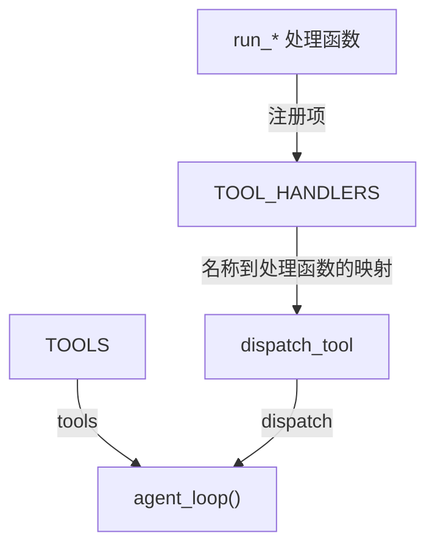

# s02：工具调用

这一章在 s01 的单个 `bash` 工具上增加工具定义、处理函数和分发器，让模型可以直接选择 `read_file`、`grep`、`write_file`、`edit_file` 和 `glob`，不必把所有操作都翻译成 shell 命令。

## 核心变化

```text
tool_name + arguments → TOOL_HANDLERS → handler(**arguments) → tool_result
```

## 组装结构

箭头表示左侧向右侧提供工具定义、注册项或函数参数；运行调用顺序见下方调用链。



本章只关注多工具结构：工具定义和统一分发入口传给循环，具体处理函数注册到 `TOOL_HANDLERS`，再由 `dispatch_tool()` 使用。

## 组件关系与调用链

本章没有新增类，核心职责由三个数据/函数层次组成：

| 组件 | 作用 |
| --- | --- |
| `TOOLS` | 告诉模型有哪些工具以及参数格式；只描述协议，不执行工具 |
| `TOOL_HANDLERS` | 保存工具名称到 Python 处理函数的映射 |
| `dispatch_tool()` | 根据名称查找 handler，统一捕获参数和运行错误 |
| `agent_loop()` | 请求模型、提取 `tool_use`、调用分发器并回传 `tool_result` |
| `run_read()` / `run_grep()` / `run_write()` / `run_edit()` / `run_glob()` | 各自负责读取、内容定位或文件操作 |

调用关系是：

```text
agent_loop
    ↓
dispatch_tool(name, arguments)
    ↓
TOOL_HANDLERS[name]
    ↓
具体 run_* 方法
    ↓
tool_result
```

这样拆分的原因是：核心循环只负责 Agent 协议，分发器只负责查找和错误边界，具体方法只负责工具本身。新增工具时主要增加定义、处理函数和注册映射，不需要改动循环。

`read_file` 的 `start_line` 使用从 1 开始的行号，配合 `limit` 只读取大文件中的必要区间。例如 `{"path": "code.py", "start_line": 560, "limit": 80}`，不会为了查看一个方法把整个文件送入上下文。

## 工具预算与代码定位

工具预算在 s02 实际执行，不等到 Skills 章节才强制限制；它与 s07 的会话压缩预算独立。

| 工具 | 返回预算 | 超限处理 |
|---|---|---|
| `read_file` | 2000 行或 50 KiB UTF-8 字节，先到者生效 | 保留完整行，给出准确的下一 `start_line`；超大单行报告限制 |
| `grep` | 100 个匹配、50 KiB，匹配行最多 500 字符 | 显示路径与行号，提示缩小范围或用 `read_file` 补读 |
| `bash` | 末尾 2000 行或 50 KiB | 完整文本存入 `.sessions/tool-results/*.txt`，返回末尾与存档路径 |

例如先用 `grep({"path":"s12_skill_loading/code.py","pattern":"def scan"})` 得到行号，再用 `read_file` 读取方法；这里展示的是工具参数，不是终端命令。`grep` 只搜索指定文件中的字面文本，不执行 shell，也不递归目录。shell 的非零退出码作为错误反馈；输出预算只限制回传文本，不限制子进程运行时的完整内存占用。

终端只显示前 200 字符预览，不等于模型也只收到 200 字符。预算说明文字不计入正文的 50 KiB。

新增工具只需要两步：

1. 在 `TOOLS` 中声明名称、用途和参数 schema；
2. 在 `TOOL_HANDLERS` 中注册名称到处理函数的映射。

核心循环仍然不变，只把 s01 的固定 `run_bash(command)` 换成通用的 `dispatch(name, arguments)`。

模型之所以能返回 `tool_use`、工具名和参数，不是因为系统提示词手写了响应格式，而是因为请求中的 `tools` 参数遵循模型服务商的工具调用协议。模型服务根据工具定义生成结构化响应，代码只负责解析、执行并回传 `tool_result`。

## 运行

在项目根目录执行：

```powershell
python -m s02_tool_use.code
```

示例任务：`读取 README.md`、`查找所有 Python 文件`、`创建一个测试文件再读回来`。

本章的文件工具限制在工作目录内，但 `bash` 仍可执行模型生成的命令；完整权限控制留到后续章节。

终端会用不同标签显示工具名、参数和结果摘要，便于观察多个工具调用的顺序。

系统提示词要求优先使用专用工具、避免主动扫描工作区，并在信息足够时停止；在 Windows 下，`bash` 工具实际执行 `cmd.exe` 命令。

## 参考与差异

- `lcc` 使用“工具定义 + handler 注册表”，目的是让新增工具只改注册处，保持 s01 循环稳定。
- Pi 的读取和 shell 分别保留开头与末尾，默认 2000 行 / 50 KiB；本章保留这种独立预算，避免在 s12 特设小窗口。lcc s02 用前 50,000 字符简单裁剪；本项目按 UTF-8 字节控制并提供继续位置与存档。s03 验证只读路径权限，s07 验证预算与压缩分工，s12 验证技能复用。
- Pi 提供可选的 grep、find、ls；默认编程组合不一定启用搜索工具。本章只增加指定文件的字面搜索，解决已有方法定位需求，不提前加入目录递归、正则和索引；s03 为 grep 增加权限判断，s12 使用相同工具定义。
- 本章沿用这个结构，并采用 `pi` 中工具名、参数、处理函数分离的思路；这样后续可在 s03（权限边界）和 s04（Hooks）中独立加入校验与生命周期控制。
- 本章暂不引入 `pi` 的 schema 校验、事件流和并行执行，因为当前先验证顺序分发；s03 先实现工具权限，schema 校验、事件流和并行执行将在后续运行时章节（编号待定）实现。
