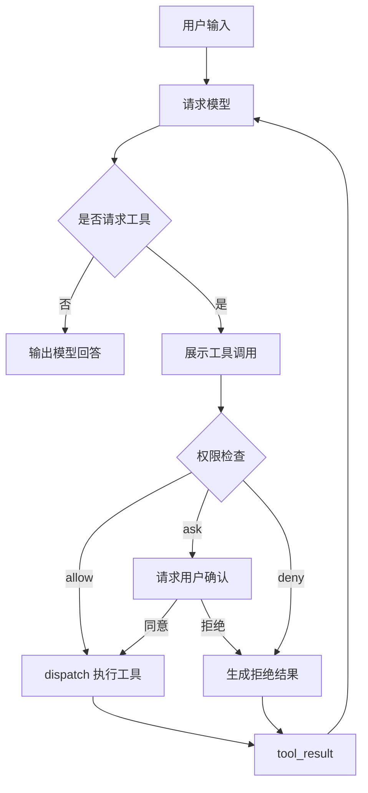

# s03：工具权限

这一章在 s02 的工具分发前增加权限门禁，区分自动允许、需要用户确认和直接拒绝三种结果。

## 架构流程



```text
tool_call → check_permission → confirm（必要时） → dispatch → tool_result
```

## 组件关系与调用链

本章新增的核心组件如下：

| 组件 | 作用 |
| --- | --- |
| `PermissionStatus` | 表示 `allow`、`ask`、`deny` 三种决定 |
| `PermissionDecision` | 携带权限状态和原因的不可变结果对象 |
| `check_permission()` | 根据工具名称、路径和命令规则生成权限决定 |
| `confirm_permission()` | 对 `ask` 状态发起终端确认 |
| `execute_tool()` | 组织权限检查、用户确认和实际执行 |
| `dispatch_tool()` | 只负责查找并执行具体 handler，沿用 s02 |

核心调用关系是：

```text
agent_loop()
    ↓
execute_tool()
    ├─ check_permission()
    ├─ confirm_permission()  （仅 ask）
    └─ dispatch_tool()
           ↓
       具体工具 handler
```

`check_permission()` 只做策略判断，`confirm_permission()` 只负责交互，`dispatch_tool()` 只负责执行。`execute_tool()` 是本章的组合入口，因此后续 s04 可以只替换这个入口的生命周期，而不用把权限代码散落到每个工具中。

只读工具自动允许；写入、编辑和可能产生副作用的命令需要确认；明显高危命令直接拒绝。权限拒绝会作为工具结果返回模型，核心循环不会因此崩溃。

## 运行

```powershell
python -m s03_permission.code
```

可以尝试：`读取 README.md`、`创建一个测试文件`、`执行 dir`。写入文件时终端会显示原因并等待输入 `y` 或 `n`。

## 参考与差异

- `lcc` 用黑名单、风险规则和用户确认在工具执行前建立教学式安全边界，目的是让权限判断集中在 Harness，而不是交给模型自行决定。
- 本章保留这个三段式思路，但用 `PermissionDecision` 和独立的 `execute_tool` 表达，避免把权限分支散落到各个 handler；路径边界仍由代码检查，bash 规则只是一层应用策略，不等于系统沙箱。
- `pi` 默认不提供文件、进程和网络权限隔离，但提供工具调用前后的拦截点。本章先实现权限策略，s04 已把 `execute_tool` 前后的处理抽象为 `before_tool_call` / `after_tool_call` Hooks。
- 本章暂不实现容器或操作系统级沙箱；如果后续需要真正隔离，会在运行时章节（编号待定）单独讨论。
