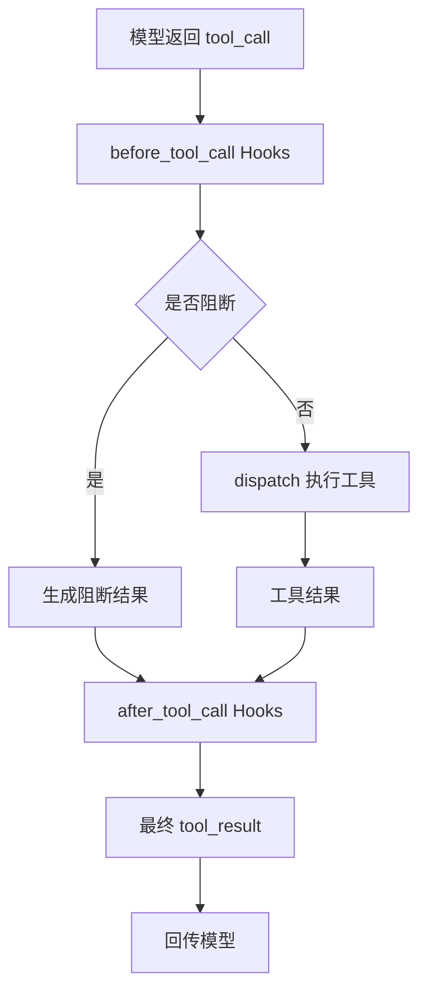

# s04：工具调用 Hooks

这一章复用 s03 的工具和权限策略，把工具执行前后的扩展逻辑抽成可注入的 Hooks。

## 架构流程



```text
tool_call → before_tool_call → dispatch → after_tool_call → tool_result
```

## 组件关系与调用链

本章新增的核心组件如下：

| 组件 | 作用 |
| --- | --- |
| `Hooks` | 保存前置 Hook 和后置 Hook 列表，作为运行时依赖容器 |
| `run_before_hooks()` | 按顺序运行前置 Hook，返回第一个阻断原因 |
| `run_after_hooks()` | 按顺序传递和转换工具结果 |
| `make_permission_hook()` | 把 s03 的权限函数适配成前置 Hook |
| `execute_tool()` | 组织前置 Hook、工具分发和后置 Hook |
| `agent_loop()` | 只负责消息循环，并把工具生命周期交给 `Hooks` |

核心调用关系是：

```text
agent_loop()
    ↓
execute_tool()
    ├─ run_before_hooks()
    │      └─ make_permission_hook()
    ├─ dispatch()
    └─ run_after_hooks()
```

`Hooks` 只保存函数，不负责执行；两个 `run_*_hooks()` 负责生命周期调度；`execute_tool()` 负责组合流程；`agent_loop()` 不再知道权限、日志或结果处理的具体实现。这样新增行为时可以注册 Hook，而不必继续修改核心循环。

前置 Hook 可以阻止工具调用，后置 Hook 可以观察或转换工具结果；多个 Hook 按注册顺序执行，前置 Hook 首次阻断后不再执行工具。

`BeforeToolHook` 返回 `None` 表示放行，返回字符串表示阻断原因；`AfterToolHook` 接收当前结果并返回处理后的结果。

## 运行

```powershell
python -m s04_hooks.code
```

本章默认把 s03 的权限策略注册为 `before_tool_call`，因此写入文件和高风险命令仍会请求确认。

## 参考与差异

- `lcc` 将扩展逻辑直接放在核心循环中，目的是保持教学代码短小；本章把工具生命周期拆成前置和后置阶段，解决新增日志、权限和结果处理时反复修改循环的问题。
- `pi` 通过工具调用前后的回调提供运行时扩展点。本章采用函数注入和 `Hooks` 数据类实现同类结构，但保持同步、顺序执行，便于观察调用流程；权限策略仍复用 s03，不复制 lcc 代码。
- s03 的权限检查在本章落地为 `make_permission_hook()`；后续运行时章节（编号待定）再讨论事件流、并行工具调用和更完整的扩展注册机制。
