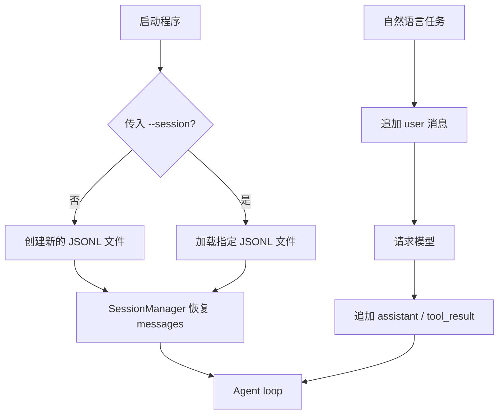

# s05：会话持久化

本章在 s04 的 Agent loop 上增加线性 JSONL 会话：每次默认创建新对话；只有在启动时传入 `--session`，才加载指定历史记录。

## 架构流程



```text
Message → SessionMessage → JsonlSessionStore → SessionManager → agent_loop
```

## 组件关系与调用链

| 层次 | 组件 | 作用 |
| --- | --- | --- |
| 消息模型 | `SessionMessage` | 在 Agent 消息与 JSONL 记录间转换 |
| 存储层 | `JsonlSessionStore` | 只负责按行追加和顺序读取文件 |
| 管理层 | `SessionManager` | 对外提供打开、加载和追加消息的接口 |
| 启动选择 | `session_path_from_cli()` | 默认创建新文件；只在 `--session` 存在时选择历史文件 |

`main()` 先调用 `session_path_from_cli()`，再用 `SessionManager.open()` 加载历史，并将 `session.append_message` 注入 `agent_loop()`。`_append_message()` 同时更新内存 `messages` 与 JSONL，确保恢复后仍包含工具调用及其结果。

会话管理不进入交互循环：`/new`、`/sessions`、`/resume` 都不是本章功能，输入的每一行都会作为自然语言任务发送给 Agent。这样 `main()` 和 Agent loop 只需维护一个当前会话，创建或恢复由启动参数决定。

## 运行

```powershell
# 创建新的独立会话；实际文件路径会在启动后打印
python -m s05_session.code

# 加载一个已有的历史会话
python -m s05_session.code --session .sessions\session-20260919-120000.jsonl
```

从项目根目录使用 `-m` 运行，以保证章节之间的兄弟模块可以正常导入。默认会话保存在 `.sessions/`；`--session` 指向的文件必须已经存在。

## 参考与差异

- `lcc` 的 memory 同时处理长期存储、召回、提取与整理，解决跨会话知识复用；本章只保留原始对话记录，避免把会话恢复与长期记忆混为一层。长期记忆将在后续章节实现，编号待定。
- `pi` 的 session 采用追加式记录，并从持久化状态重建上下文，解决运行中断后的连续对话；本章保留这一方向，但改为“默认新建、显式路径恢复”，以便先清楚展示一个线性文件的职责。s06 已将“完整日志”和“模型上下文”拆为投影关系；会话树、分支和事务将在后续会话运行时章节实现，编号待定。
- s04 的 Hooks 仍只管理工具生命周期；s05 通过保存回调写入消息，保证 Harness 机制不需要出现在系统提示词中。s06 已定义 compaction checkpoint 的持久化载体；摘要生成将在 s07 实现，上下文 token 预算与自动触发将在 s08 实现。
