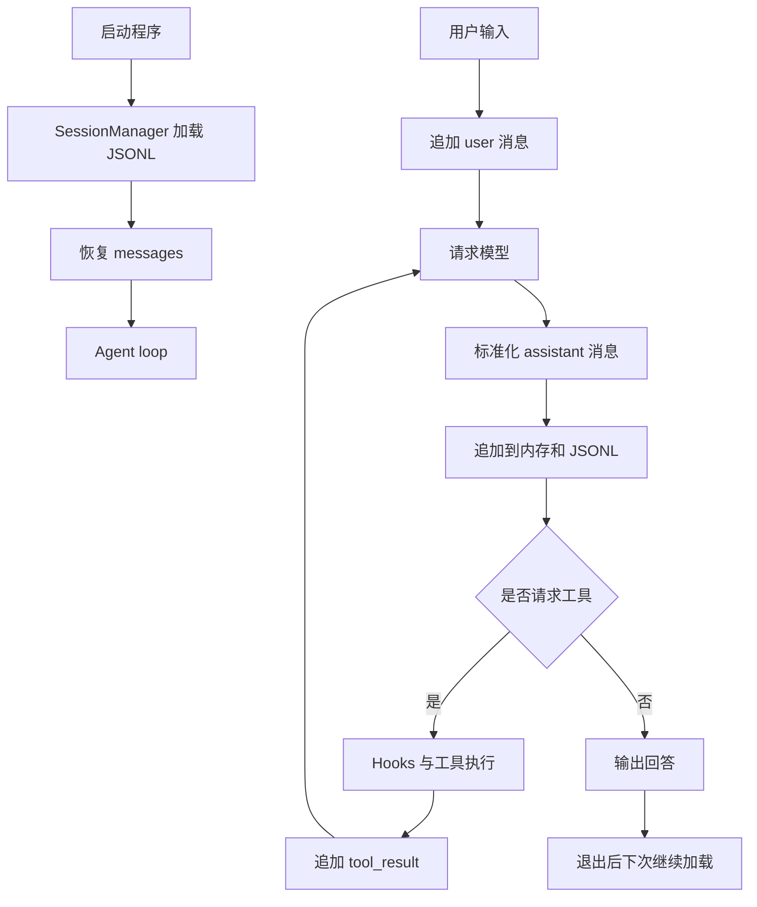

# s05：会话持久化

这一章在 s04 的 Agent loop 上增加线性会话持久化，让程序退出后可以恢复之前的对话。

## 架构流程



```text
Message → SessionMessage → JsonlSessionStore → SessionManager
```

## 组件关系与调用链

本章新增的核心组件分为三层：

| 层次 | 组件 | 作用 |
| --- | --- | --- |
| 消息模型 | `SessionMessage` | 在 Agent 消息和 JSONL 记录之间转换 |
| 存储层 | `JsonlSessionStore` | 只负责文件追加写入和顺序读取 |
| 管理层 | `SessionManager` | 对外提供打开、加载和追加消息的接口 |

辅助方法的关系：

- `_to_jsonable()`：把 Anthropic SDK 对象转换成普通 JSON 值，供 `SessionMessage` 使用；
- `_append_message()`：同时更新内存 `messages` 和持久化存储，避免两边写法不一致；
- `agent_loop()`：在 assistant 和 tool_result 消息产生时调用保存函数；
- `main()`：创建 `SessionManager`，启动时加载历史，并把 `session.append_message` 注入 `agent_loop()`。

完整调用关系是：

```text
main()
    ├─ SessionManager.open()
    ├─ SessionManager.load_messages()
    │      └─ JsonlSessionStore.read_all()
    └─ agent_loop(save_message=session.append_message)
           └─ _append_message()
                  ├─ 更新内存 messages
                  └─ SessionManager.append_message()
                         └─ JsonlSessionStore.append()
```

这样设计的重点是隔离职责：存储层不理解 Agent loop，管理层不处理模型响应，核心循环只依赖一个可选的保存函数。后续替换为数据库、树形 session 或内存存储时，不需要重写工具和模型调用流程。

会话文件默认保存到 `.sessions/default.jsonl`，每行是一条带 `role`、`content` 和时间戳的消息记录。模型 SDK 的响应对象会先转换为普通字典，再写入 JSONL。

## 运行

```powershell
python s05_session/code.py
```

退出后再次运行，程序会继续读取同一个会话文件。也可以通过 `SESSION_FILE` 环境变量指定其他 JSONL 文件。

## 参考与差异

- `lcc` 的 memory 同时处理长期存储、相关召回、自动提取和记忆整理，目的是让跨会话知识可以被选择性复用；本章先拆出更基础的会话持久化，避免把“对话记录”和“长期语义记忆”混在一起。
- `pi` 的 session 设计强调追加式记录和从持久化状态重建当前上下文。本章保留这个方向，但先使用线性 JSONL，不引入 `parentId`、分支树和复杂事件类型；后续会话运行时章节（编号待定）再实现分支与压缩。
- s04 的 Hooks 继续负责工具生命周期，s05 只在消息产生时注入保存函数；上下文预算与压缩将在后续章节（编号待定），显式长期记忆和自动召回再另行实现。
