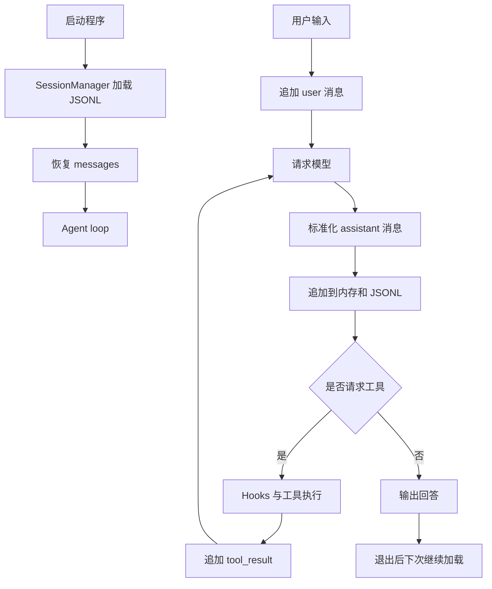

# s05：会话持久化

这一章在 s04 的 Agent loop 上增加线性会话持久化，让程序退出后可以恢复之前的对话。

## 架构流程



```text
Message → SessionMessage → JsonlSessionStore → SessionManager
```

会话文件默认保存到 `.sessions/default.jsonl`，每行是一条带 `role`、`content` 和时间戳的消息记录。模型 SDK 的响应对象会先转换为普通字典，再写入 JSONL。

## 运行

```powershell
python s05_session/code.py
```

退出后再次运行，程序会继续读取同一个会话文件。也可以通过 `SESSION_FILE` 环境变量指定其他 JSONL 文件。

## 参考与差异

- `lcc` 的 memory 同时处理长期存储、相关召回、自动提取和记忆整理，目的是让跨会话知识可以被选择性复用；本章先拆出更基础的会话持久化，避免把“对话记录”和“长期语义记忆”混在一起。
- `pi` 的 session 设计强调追加式记录和从持久化状态重建当前上下文。本章保留这个方向，但先使用线性 JSONL，不引入 `parentId`、分支树和复杂事件类型；后续会话运行时章节（编号待定）再实现分支与压缩。
- s04 的 Hooks 继续负责工具生命周期，s05 只在消息产生时注入保存函数；上下文预算与压缩将在后续章节（编号待定），显式长期记忆和自动召回再另行实现。
