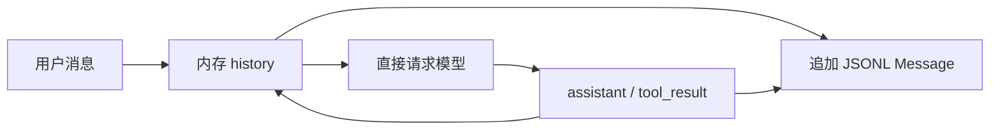
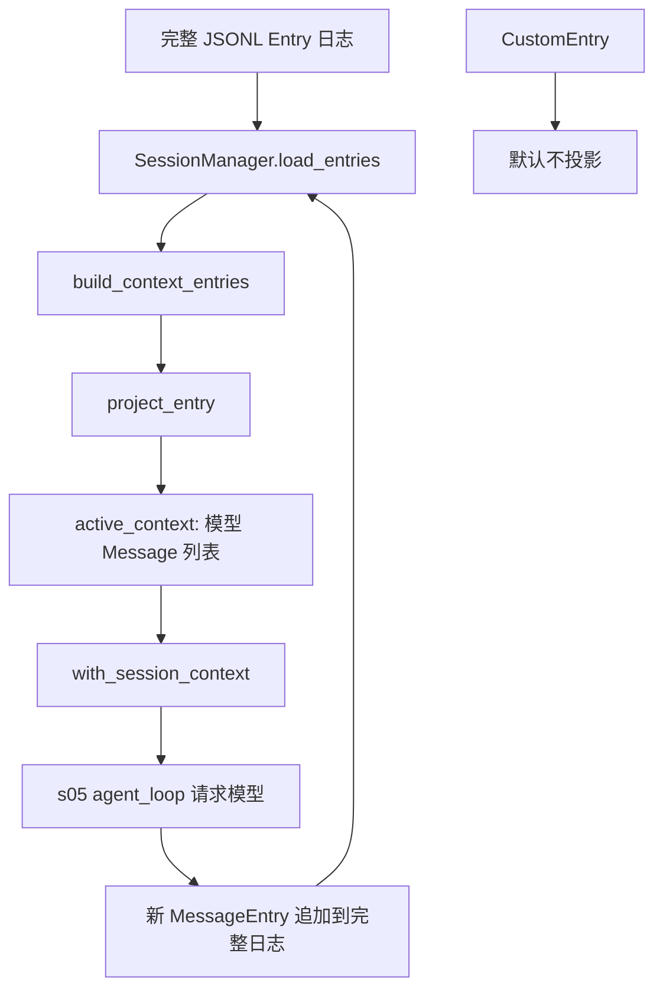

# s06：会话上下文投影

s05 把 JSONL 中的全部消息直接作为模型上下文；s06 改为保存完整 Session Entry 日志，并在每次模型请求前投影出当前活跃上下文。

## 先统一术语

```text
模型运行时 Message → 内存 Session Entry → JSONL Record（一行）
JSONL Record → Session Entry → 活跃 Message 上下文 → 模型请求
```

| 名称 | 是什么 | 示例 | 是否直接发送给模型 |
| --- | --- | --- | --- |
| `Message` | 模型 API 使用的 `role/content` 字典 | `{"role": "user", "content": "你好"}` | 是 |
| `SessionEntry` | 带持久化语义的会话对象 | `MessageEntry`、`CompactionEntry`、`CustomEntry` | 取决于类型 |
| `Record` | Entry 写入或读出 JSONL 时的原始字典 | `{"type": "message", "message": {...}}` | 否 |
| JSONL | 磁盘文件格式 | 一行一个 Record | 否 |

`_` 开头的方法是模块内部辅助函数的 Python 约定，不是公开接口：例如 `_message_from_record()` 只在“原始 Record → Message”的读取边界使用，`_summary_message()` 只负责“CompactionEntry → 摘要 Message”的投影细节。

## s05 与 s06 的共同点

- 都是线性、追加式 JSONL 会话；不会覆盖旧记录。
- 都使用 `--session <路径>` 恢复历史；默认启动创建新会话。
- 都在用户、助手和工具结果消息产生时写入磁盘。
- 都复用 s04 的权限 Hook 与 s05 的 `agent_loop()`；工具调用行为不变。
- 没有 compaction 时，s06 发送给模型的消息顺序与 s05 基本一致。

## 设计变化与功能流程

### s05：完整历史就是模型上下文



`SessionManager.load_messages()` 返回全部历史，`agent_loop()` 直接将该列表发送给模型。因此“完整事实记录”与“模型可见上下文”是同一个列表。

### s06：完整日志经过投影后才发送模型



每轮的实际路径是：

```text
用户输入
  → SessionManager.append_message()
  → SessionManager.build_context()
  → agent_loop(active_context)
  → with_session_context() 再次 build_context()
  → 模型请求
  → assistant / tool_result 追加为 MessageEntry
```

`active_context` 只是当前发送给模型的局部列表，不是完整历史；完整事实只能通过 `SessionManager.load_entries()` 读取。`with_session_context()` 在每一次模型请求前重新构建上下文，所以工具结果写入后，下一次请求会立即看到最新日志。

## 哪些代码变了

| s06 代码 | 相对 s05 | 原因 |
| --- | --- | --- |
| `MessageEntry`、`CompactionEntry`、`CustomEntry` | 新增 | 让日志可表达消息、摘要 checkpoint 与扩展状态，不再只有消息。 |
| `entry_from_record()` | 新增 | 在 JSONL 读取边界把无类型 Record 还原为对应 Entry。 |
| `JsonlSessionStore.append()` / `read_all()` | 修改 | 从只读写 `SessionMessage` 改为读写多类型 `SessionEntry`。 |
| `build_context_entries()`、`project_entry()`、`build_session_context()` | 新增 | 将完整日志转换为模型可见 Message 列表。 |
| `SessionManager.load_entries()` | 新增 | 替代 s05 的 `load_messages()`，显式读取完整事实。 |
| `SessionManager.build_context()` | 新增 | 提供唯一的活跃模型上下文构建入口。 |
| `SessionManager.append_message()` | 修改 | 从写入 `SessionMessage` 改为写入 `MessageEntry`。 |
| `append_compaction()`、`append_custom()` | 新增 | 分别写入已有 checkpoint 与扩展状态。 |
| `with_session_context()` | 新增 | 在不改动 s05 `agent_loop()` 的前提下，注入实时投影结果。 |
| `main()` | 修改 | 将 `history` 改为 `active_context`，并使用 `with_session_context()`。 |
| `session_path_from_cli()`、`agent_loop()`、`SYSTEM`、工具分发 | 来自 s05：保持 | 会话投影不改变启动策略、系统提示词或工具执行职责。 |

## Entry 如何投影为 Message

| Entry 类型 | 保存在日志中的内容 | 投影结果 |
| --- | --- | --- |
| `MessageEntry` | 一条用户、助手或工具结果 Message | 原样变为一条 Message |
| `CompactionEntry` | `summary` 与 `retained_tail` | 一条摘要 Message，加上保留尾部 Message |
| `CustomEntry` | `custom_type` 与扩展数据 | 当前为零条 Message |

`build_context_entries()` 会从后向前找到最近的 `CompactionEntry`。若不存在 checkpoint，全部 Entry 都参与投影；若存在，则 checkpoint 之前的完整日志仍留在磁盘，但不再进入模型上下文。

## 运行

```powershell
# 创建新会话；启动后会打印实际文件路径
python -m s06_session_context.code

# 加载已有的 s05 或 s06 会话
python -m s06_session_context.code --session .sessions\session-20260919-120000.jsonl
```

s06 可读取 s05 的旧扁平 `message` Record；但 s05 不认识 s06 的嵌套 `message`、`compaction` 和 `custom` Record，因此升级后应继续使用 s06 或更高章节打开该文件。

## 参考与差异

- Pi 把 Session 设计为多类型追加式 Entry，并通过 `buildSessionContext()` 从最近 compaction checkpoint 重建模型上下文，解决“完整审计记录”与“有限上下文窗口”不能共用一份列表的问题。s06 保留 Entry 与投影边界，但不采用 Pi 的分支与事务模型；当前只处理线性 JSONL 日志。s07 将通过 `append_compaction()` 验证 checkpoint 写入。
- lcc 在 Context Compact 一章同时实现 token 估算、截断和摘要。本项目将投影层单独实现，使完整日志和模型输入的关系保持清晰。
- Pi 的 `custom` Entry 可由注入的 projector 决定是否进入模型上下文。s06 使用固定规则：`custom` 只持久化，不投影到 `agent_loop()`。
