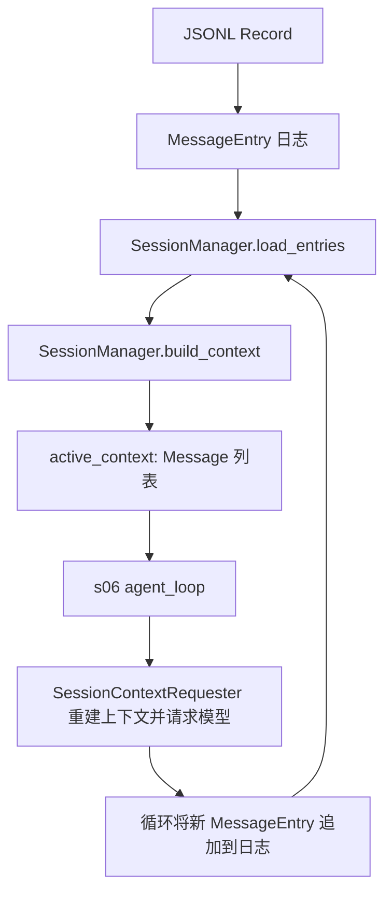
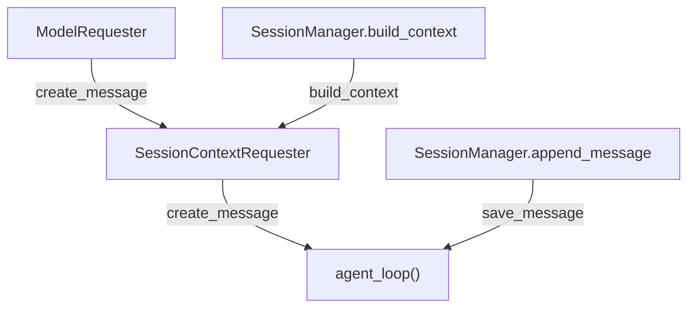

# s06：会话系统 · 记录与上下文投影

s05 直接把 JSONL 中的全部消息作为模型上下文；s06 将磁盘日志表示为 `MessageEntry`，再显式构建独立的 `active_context` 发送给模型。

## 术语

```text
模型运行时 Message → MessageEntry → JSONL Record（一行）
JSONL Record → MessageEntry → active_context → 模型请求
```

| 名称 | 是什么 | 示例 |
| --- | --- | --- |
| `Message` | 模型 API 使用的 `role/content` 字典 | `{"role": "user", "content": "你好"}` |
| `MessageEntry` | 保存一条 Message 的会话日志对象 | `MessageEntry(message=...)` |
| `Record` | MessageEntry 写入或读出 JSONL 时的原始字典 | `{"type": "message", "message": {...}}` |

`_` 开头的方法是模块内部辅助函数：`_normalize_message()` 整理要写入的消息，`_message_from_record()` 校验从 JSONL 读出的消息。

## s05 与 s06 的关系

共同点：两章都使用线性、追加式 JSONL；都通过 `--session <路径>` 加载历史；都在用户、助手和工具结果消息产生时保存；工具、权限 Hook 和 `agent_loop()` 的行为保持不变。为便于顺着单个章节阅读，s06 在当前文件中完整展开 `agent_loop()`，没有直接引用 s05 的函数。

区别是消息的职责：

| s05 | s06 |
| --- | --- |
| `load_messages()` 直接得到模型 Message 列表 | `load_entries()` 先得到完整 `MessageEntry` 日志 |
| 完整历史就是模型上下文 | `build_context()` 显式创建独立的 `active_context` |
| 模型请求直接使用 `history` | `SessionContextRequester` 在请求边界重新构建上下文 |

当前没有筛选或压缩规则，因此 s06 的 `active_context` 内容与完整消息日志一致；变化在于两个概念已经有了独立边界。

## 功能流程



每轮任务的调用链：

```text
用户输入
  → SessionManager.append_message()
  → SessionManager.build_context()
  → agent_loop(active_context)
  → SessionContextRequester 重新 build_context()
  → 模型请求
  → assistant / tool_result 追加为 MessageEntry
```

`active_context` 只是当前模型输入；完整日志通过 `SessionManager.load_entries()` 获取。`SessionContextRequester` 会在每次模型请求前重新调用 `build_context()`，因此工具结果落盘后，下一次模型请求能够读取最新上下文。

请求方法显式执行三步：`active_context = self.build_context()` 构建上下文，`kwargs["messages"] = active_context` 替换本次请求参数，再调用 `self.create_message(**kwargs)`。这里不会修改循环持有的内存列表；`kwargs` 是本次调用收集到的关键字参数字典。

## 组装结构

箭头表示左侧组件作为构造参数、绑定方法或保存函数提供给右侧组件；它不表示请求顺序。



本章新增的 `SessionContextRequester` 接收底层模型请求器和 Session 的上下文构建方法，再作为循环的 `create_message`；Session 的追加方法仍作为 `save_message`。

## 方法变化

| s06 代码 | 相对 s05 | 作用 |
| --- | --- | --- |
| `MessageEntry` | 新增 | 将一条模型 Message 包装为持久化日志对象。 |
| `entry_from_record()` | 新增 | 将 JSONL Record 校验并恢复为 `MessageEntry`。 |
| `JsonlSessionStore.append()` / `read_all()` | 修改 | 从读写 `SessionMessage` 改为读写 `MessageEntry`。 |
| `build_session_context()` | 新增 | 从完整 MessageEntry 日志创建独立的模型 Message 列表。 |
| `SessionManager.load_entries()` | 新增 | 返回完整 MessageEntry 日志。 |
| `SessionManager.build_context()` | 新增 | 作为构建活跃模型上下文的唯一入口。 |
| `SessionManager.append_message()` | 修改 | 将 Message 包装为 `MessageEntry` 后写入日志。 |
| `SessionContextRequester` | 新增 | 在模型请求边界注入最新上下文。 |
| `main()` | 修改 | 使用 `active_context` 与 `SessionContextRequester`。 |
| `agent_loop()` | 来自 s05：展开保持 | 行为不变，但在 s06 文件中完整展示请求、工具调用和消息保存流程。 |
| `session_path_from_cli()`、`SYSTEM`、工具分发 | 来自 s05：保持 | 会话投影不改变启动、提示词或工具职责。 |

## 运行

```powershell
# 创建新会话；启动后会打印实际文件路径
python -m s06_session_context.code

# 加载已有的 s06 会话
python -m s06_session_context.code --session .sessions\s06\session-20260919-120000.jsonl
```

s06 只读取并写入自身的嵌套 `message` Record；默认会话目录为 `.sessions/s06/`。

## 参考与差异

- Pi 将会话日志和模型上下文分开：日志记录完整事实，运行时再从日志构建模型输入，解决两者职责混杂的问题。s06 保留这一边界，但只实现线性消息日志和一对一投影。
- lcc 的 Context Compact 同时包含 token 估算、截断和摘要。本章只实现其中更基础的上下文构建边界，方便观察模型输入从哪里产生。
