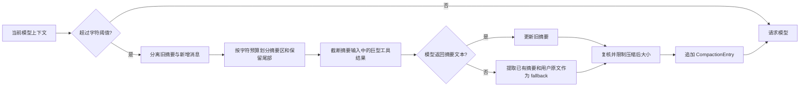
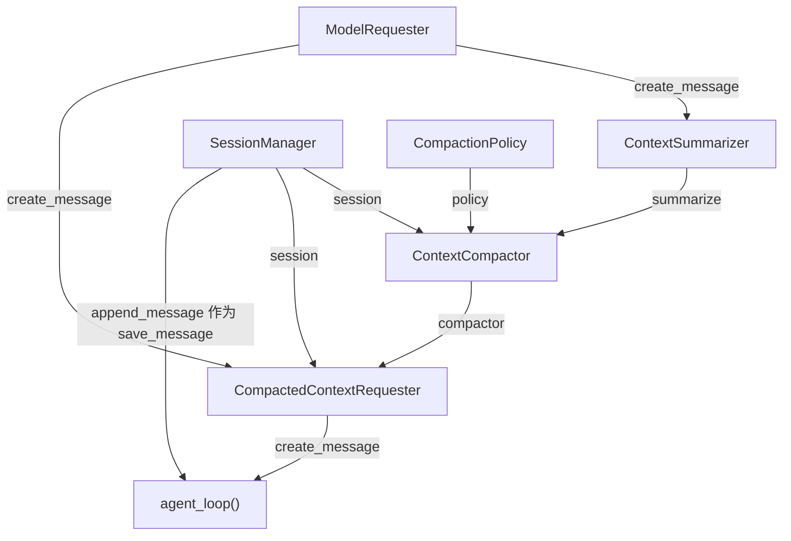

# s07：会话系统 · 上下文压缩

s06 将完整日志投影为模型上下文；s07 在每次模型请求前检查该上下文的字符数。超过阈值时，较早消息会被总结为 `CompactionEntry`，最近消息仍原样保留。

## 架构流程



```text
MessageEntry ... → CompactionEntry(summary + retained_tail) → active_context → 模型请求
```

## 组装结构

箭头统一表示左侧组件作为标注参数传给右侧组件；调用先后见上方架构流程。



装配顺序与代码一致：`policy`、`session`、`summarizer` 传给 `ContextCompactor`；`compactor`、`session`、底层 `requester` 再传给 `CompactedContextRequester`；最后把 `request_with_context` 作为 `create_message` 传给 `agent_loop()`。因此循环调用它时，会依次触发压缩判断、最新上下文投影和模型请求。

## 组件关系

| 组件 | 作用 | 调用关系 |
| --- | --- | --- |
| `CompactionPolicy` | 定义总字符阈值和最近上下文字符预算 | 供 `ContextCompactor` 判断和分割 |
| `ContextCompactor` | 分割上下文、调用摘要函数、写入压缩记录 | 请求前由 `CompactedContextRequester` 调用 |
| `CompactionOutcome` | 保存压缩来源及压缩前后字符数 | 供请求层直接打印压缩结果 |
| `CompactionEntry` | 保存摘要与最近消息 | 被 `SessionManager` 追加到 JSONL |
| `build_session_context()` | 只投影最新压缩点及其后的消息 | 每次请求前重新运行 |
| `CompactedContextRequester` | 在一次模型请求前执行压缩并注入最新上下文 | 由入口显式组装会话依赖 |
| `agent_loop()` | 展示完整的模型与工具循环 | 行为继承 s06，在 s07 文件中展开并调用压缩请求组件 |

压缩不会删除旧的 `MessageEntry`。读取时只从最后一个 `CompactionEntry` 开始：先放入摘要和它的 `retained_tail`，再追加该压缩点之后的新消息。因此 JSONL 保留完整事实，模型上下文保持较小。

保留尾部使用字符预算，而不是固定消息条数。若单条工具结果超过预算，它会进入摘要区；摘要请求最多保留该工具结果的前 2000 字符。完整内容仍留在 JSONL。若边界落在 `assistant(tool_use)` 与 `user(tool_result)` 之间，二者会一起保留或一起进入摘要区。

再次压缩时，最新 `CompactionEntry.summary` 会作为 `previous_summary` 单独传入摘要器；摘要区只包含旧压缩点的保留尾部和之后新增的 `MessageEntry`。这样模型执行的是“更新已有摘要”，不会把 `[会话摘要]` 当作普通对话反复总结。

`main()` 先选择会话路径、打开会话，再以具名参数组装组件：`ContextSummarizer` 保存摘要请求所需的模型请求器与额度，`ContextCompactor` 负责压缩决策和落盘。入口将 `CompactedContextRequester` 传给本章展开的 `agent_loop()`，由循环在需要模型响应时调用它。

正常请求顺序为：`compact_if_needed()` 检查并按需保存压缩结果 → `session.build_context()` 重建上下文 → 替换本次请求的 `messages` → 请求模型。摘要生成直接调用底层请求器，避免再次触发压缩。投影函数从日志末尾向前寻找最新压缩点，再依次追加摘要、保留尾部和新消息。

## 运行

```powershell
# 创建 s07 专属会话；超过默认 24000 字符时自动压缩
python -m s07_session_compaction.code

# 加载已有 s07 会话
python -m s07_session_compaction.code --session .sessions\s07\session-20260919-120000.jsonl
```

`.env` 中可调整当前章节实际使用的参数：

```ini
SESSION_COMPACTION_MAX_CHARS=24000
SESSION_COMPACTION_KEEP_RECENT_CHARS=12000
SESSION_COMPACTION_SUMMARY_MAX_TOKENS=1024
```

`SESSION_COMPACTION_MAX_CHARS` 使用字符数近似上下文大小，便于直接观察和测试；它不是精确 token 计数。`SESSION_COMPACTION_KEEP_RECENT_CHARS` 必须小于等于总阈值的一半，为摘要留出空间。

若摘要响应只有 `thinking`、没有最终文本，s07 会自动以至少 1024 token 重试一次。仍未取得文本时，fallback 会保留已有摘要、摘要区最近三条用户原文和完整 JSONL 路径。摘要写入前会再次计算压缩后大小，必要时添加明确标记并裁剪摘要，保证结果不超过阈值。

## 测试压缩

测试时可在 `.env` 暂时使用较小预算：

```ini
SESSION_COMPACTION_MAX_CHARS=1200
SESSION_COMPACTION_KEEP_RECENT_CHARS=400
```

启动一个新会话，连续发送几条数百字消息即可触发。终端会直接显示：

```text
会话  已压缩 1860 → 720 字符，总结 3 条、保留 1 条，使用模型摘要。
```

这条运行时统计就是压缩是否收敛的直接证据，不需要让 Agent 扫描 `.sessions` 或创建分析脚本。默认启动会新建会话，因此旧日志不会影响测试。

## 参考与差异

- Pi 将压缩结果作为会话 Entry 保存，按 token 预算选择保留尾部，并把旧摘要与新增消息分开更新；摘要序列化时还会截断巨型工具结果。s07 保留这些关键边界，但使用更容易观察的字符预算。
- lcc 使用工具输出持久化、裁剪、微压缩和手动压缩等多层管线。本章只实现会话摘要这一条自动路径，避免在同一章节混入多种压缩策略。
