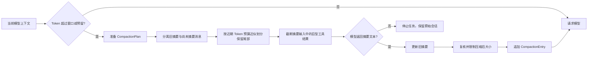
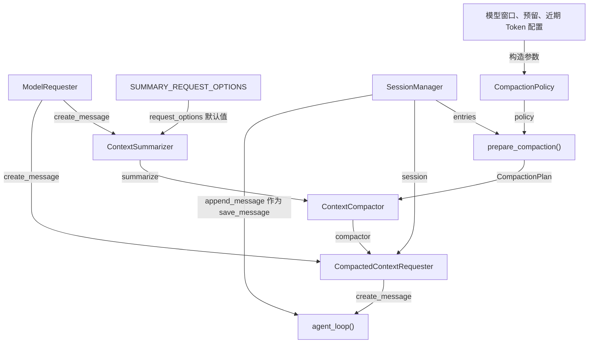

# s07：会话系统 · 上下文压缩

s06 将完整日志投影为模型上下文；s07 在每次模型请求前估算 Token。接近实际模型窗口时，较早消息会被总结为 `CompactionEntry`，近期消息仍原样保留。工具返回预算由 s02 管理，不与会话预算混用。

## 架构流程



```text
MessageEntry ... → CompactionEntry(summary + retained_tail) → active_context → 模型请求
```

## 组装结构

箭头统一表示左侧组件作为标注参数传给右侧组件；调用先后见上方架构流程。



装配顺序与代码一致：`policy`、`session`、`summarizer` 传给 `ContextCompactor`；`compactor`、`session`、底层 `requester` 再传给 `CompactedContextRequester`；最后把 `request_with_context` 作为 `create_message` 传给 `agent_loop()`。因此循环调用它时，会依次触发压缩判断、最新上下文投影和模型请求。

## 组件关系

| 组件 | 作用 | 调用关系 |
| --- | --- | --- |
| `CompactionPolicy` | 定义模型窗口、预留及近期 Token 预算 | 供 `prepare_compaction()` 判断和分割 |
| `estimate_context_tokens()` | 用字符除以四近似估算，没有精确分词承诺 | s07-s10 用于判断；s11 优先用实际 usage 校准 |
| `CompactionPlan` | 明确保存旧摘要、待总结消息和保留尾部 | 由准备阶段创建，交给 `ContextCompactor` 执行 |
| `prepare_compaction()` | 投影上下文并计算本次压缩边界 | 将完整日志和策略转换为 `CompactionPlan` |
| `ContextCompactor` | 按计划生成摘要、复核大小并写入记录 | 请求前由 `CompactedContextRequester` 调用 |
| `CompactionOutcome` | 保存压缩来源及压缩前后字符数 | 供请求层直接打印压缩结果 |
| `CompactionEntry` | 保存摘要与最近消息 | 被 `SessionManager` 追加到 JSONL |
| `build_session_context()` | 只投影最新压缩点及其后的消息 | 每次请求前重新运行 |
| `CompactedContextRequester` | 在一次模型请求前执行压缩并注入最新上下文 | 由入口显式组装会话依赖 |
| `agent_loop()` | 展示完整的模型与工具循环 | 行为继承 s06，在 s07 文件中展开并调用压缩请求组件 |

压缩不会删除旧的 `MessageEntry`。读取时只从最后一个 `CompactionEntry` 开始：先放入摘要和它的 `retained_tail`，再追加该压缩点之后的新消息。因此 JSONL 保留完整事实，模型上下文保持较小。

保留尾部使用近似 Token 预算，而不是固定消息条数。内部按每 Token 四字符换算成分割与裁剪预算，仍不是精确 tokenizer。若单条工具结果超过近期预算，它会进入摘要区；与 Pi 一样，摘要请求最多保留该工具结果的前 2000 字符。近期原始消息不走这次截断，完整工具回传文本仍留在 JSONL。若边界落在 `assistant(tool_use)` 与 `user(tool_result)` 之间，二者会一起保留或一起进入摘要区。

再次压缩时，最新 `CompactionEntry.summary` 会作为 `previous_summary` 单独传入摘要器；上次的 `retained_tail` 加上压缩点之后新增的 `MessageEntry`，共同组成“尚未被旧摘要覆盖的消息”。`prepare_compaction()` 再把它们划分为 `messages_to_summarize` 和新的 `retained_tail`。这样模型执行的是“更新已有摘要”，不会把 `[会话摘要]` 当作普通对话反复总结。

`main()` 先选择会话路径、打开会话，再以具名参数组装组件：`ContextSummarizer` 保存摘要请求所需的模型请求器与额度，`ContextCompactor` 负责压缩决策和落盘。入口将 `CompactedContextRequester` 传给本章展开的 `agent_loop()`，由循环在需要模型响应时调用它。

正常请求顺序为：`prepare_compaction()` 生成压缩计划 → `compact_if_needed()` 按计划生成并保存摘要 → `session.build_context()` 重建上下文 → 替换本次请求的 `messages` → 请求模型。摘要生成直接调用底层请求器，避免再次触发压缩。投影函数从日志末尾向前寻找最新压缩点，再依次追加摘要、保留尾部和新消息。

## 运行

```powershell
# 创建 s07 专属会话；需先填写实际模型窗口
python -m s07_session_compaction.code

# 加载已有 s07 会话
python -m s07_session_compaction.code --session .sessions\s07\session-20260919-120000.jsonl
```

`.env` 中可调整当前章节实际使用的参数：

```ini
# 仅当当前服务确认支持 128000 Token 时使用此示例值
MODEL_CONTEXT_WINDOW_TOKENS=128000
SESSION_COMPACTION_RESERVE_TOKENS=16384
SESSION_COMPACTION_KEEP_RECENT_TOKENS=20000
# 可选：符合当前模型输出上限；省略时取预留预算的 80%
SESSION_COMPACTION_SUMMARY_MAX_TOKENS=4096
```

触发点为 `context_window_tokens - reserve_tokens`；示例中为 111,616 Token，近期保留 20,000 Token。模型窗口是必填项，缺失会报错，不从模型名猜测；若服务窗口更小，也应相应减少预留与近期预算，近期预算必须小于触发点。

旧 `SESSION_COMPACTION_MAX_CHARS`、`SESSION_COMPACTION_KEEP_RECENT_CHARS` 不再读取；请从本地 `.env` 删除并替换为上述 Token 配置。已有 `SESSION_COMPACTION_SUMMARY_MAX_TOKENS` 仍是显式覆盖值，例如旧 1024 不会自动变大。程序没有模型最大输出额度注册表，显式摘要额度需按服务限制填写。

`max_context_chars` 和 `keep_recent_chars` 是 `CompactionPolicy` 内部将 Token 换算为裁剪字符数的属性，不是另一个外部配置；终端的压缩前后字符数只是观察指标。s11 从最近有效正常回答的 usage 加后续消息估算来校准触发判断；不能使用会话累计消费或摘要请求 usage 代替当前上下文大小。

摘要与正常任务的目标不同：摘要只需要最终正文，不需要继续分析或调用工具。s07 为 Anthropic 摘要请求默认传入 `thinking: {"type": "disabled"}`；该选项只在 `summarize_context()` 内使用，正常 `agent_loop()` 不携带它。[Messages API 的 thinking 参数](https://platform.claude.com/docs/en/api/http/messages)

`ContextSummarizer.request_options` 可以覆盖默认选项。s07–s09 直接使用 Anthropic；从 s10 起由 Provider 层选择本接口适用的选项，避免给 Chat Completions 发送 Anthropic 专有字段。

输出额度小于 1024 且没有正文时，仍只重试一次至 1024；不自动扩大已配置的高额度。重试后仍无正文，压缩器会停止任务，原始消息与上下文保持不变，不写入只有用户要求和历史路径的回退摘要。成功摘要写入前仍复核大小，必要时明确标记并裁剪。

注意：参数支持取决于模型与兼容服务，协议里有 `disabled` 不代表每个后端都接受或遵守它。s11 增加空摘要结构诊断，s12 直接复用；如果关闭参数已发送但仍只有思考，应检查服务支持情况，而不是把思考当摘要或无限提高额度。相关复现与证据见 [B009](../docs/bug-log.md#b009摘要额度提高后仍无正文缺少响应结构证据)。

## 测试压缩

测试时可在 `.env` 暂时使用较小预算：

```ini
MODEL_CONTEXT_WINDOW_TOKENS=1024
SESSION_COMPACTION_RESERVE_TOKENS=512
SESSION_COMPACTION_KEEP_RECENT_TOKENS=128
SESSION_COMPACTION_SUMMARY_MAX_TOKENS=1024
```

这仅用于故意触发压缩，不是模型实际容量建议；测试后恢复真实模型窗口。启动一个新会话，连续发送较长消息即可触发。终端会直接显示类似：

```text
会话  已压缩 3000 → 1500 字符，总结 3 条、保留 1 条，使用模型摘要。
```

这条运行时统计就是压缩是否收敛的直接证据，不需要让 Agent 扫描 `.sessions` 或创建分析脚本。默认启动会新建会话，因此旧日志不会影响测试。

## 参考与差异

- Pi 先准备旧摘要、待总结消息和保留尾部，再执行摘要；默认预留 16,384 Token、近期保留 20,000 Token。s07 保留两阶段和模型窗口预算，内部仍用字符除以四近似分割；s11 用已保存的有效 usage 校准触发判断，s12 复用而不另设小阈值。单条摘要输入 2000 字符截断也是 Pi 的策略，不等于近期代码立即截断。
- Pi 在摘要请求边界独立组织 reasoning 参数，不把技能章节作为摘要策略入口。s07 同样独立组织摘要选项；s10 适配接口差异，s11 验证失败诊断与用量，s12 复用这些组件。这里明确发送 `disabled`，不声称所有模型都能关闭思考。
- lcc s06 超过估算 50,000 Token 后整体摘要，轻量清理会保留 read_file 结果避免重读；本章不加入第二条清理管线，而通过较大的近期原始消息预算保留证据。s11/s12 的测试验证短审查不因旧 24,000 字符阈值提前压缩；不宣称预算能保证模型一定完成任务。
