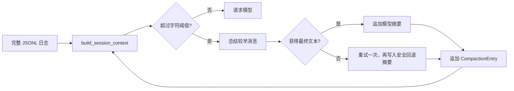

# s07：会话系统 · 上下文压缩

s06 将完整日志投影为模型上下文；s07 在每次模型请求前检查该上下文的字符数。超过阈值时，较早消息会被总结为 `CompactionEntry`，最近消息仍原样保留。

## 架构流程



```text
MessageEntry ... → CompactionEntry(summary + retained_tail) → active_context → 模型请求
```

## 组件关系

| 组件 | 作用 | 调用关系 |
| --- | --- | --- |
| `CompactionPolicy` | 定义字符阈值和保留消息数 | 供 `ContextCompactor` 判断 |
| `ContextCompactor` | 分割上下文、调用摘要函数、写入压缩记录 | 请求前由包装器调用 |
| `CompactionEntry` | 保存摘要与最近消息 | 被 `SessionManager` 追加到 JSONL |
| `build_session_context()` | 只投影最新压缩点及其后的消息 | 每次请求前重新运行 |
| `request_with_compacted_context()` | 在一次模型请求前执行压缩并注入最新上下文 | 由 `partial()` 绑定会话依赖 |

压缩不会删除旧的 `MessageEntry`。读取时只从最后一个 `CompactionEntry` 开始：先放入摘要和它的 `retained_tail`，再追加该压缩点之后的新消息。因此 JSONL 保留完整事实，模型上下文保持较小。

保留尾部时，若边界正好落在 `assistant(tool_use)` 与 `user(tool_result)` 之间，s07 会把这对消息一起保留，避免破坏模型工具调用协议。

入口组装关系只有两条：`main()` 创建 `ModelRequester`；`summarize_context()` 使用它生成摘要，`ContextCompactor` 保存压缩结果；正常模型请求则经过 `request_with_compacted_context()`，最后进入 s06 的 `agent_loop()`。

## 运行

```powershell
# 创建 s07 专属会话；超过默认 24000 字符时自动压缩
python -m s07_session_compaction.code

# 加载已有 s07 会话
python -m s07_session_compaction.code --session .sessions\s07\session-20260919-120000.jsonl
```

`.env` 中可调整当前章节实际使用的参数：

```ini
SESSION_COMPACTION_MAX_CHARS=24000
SESSION_COMPACTION_KEEP_RECENT_MESSAGES=6
SESSION_COMPACTION_SUMMARY_MAX_TOKENS=1024
```

`SESSION_COMPACTION_MAX_CHARS` 使用字符数近似上下文大小，便于直接观察和测试；它不是精确 token 计数。

若摘要响应只有 `thinking`、没有最终文本，s07 会自动以至少 1024 token 重试一次。仍未取得文本时，会写入不编造事实的回退摘要，保留最近消息并标出完整 JSONL 文件路径，Agent 不会因此中断。

## 参考与差异

- Pi 将压缩结果作为会话 Entry 保存，并在构建上下文时只使用最后一次压缩点及其后的记录。s07 保留这个边界，使“完整日志”和“模型上下文”各自职责明确。
- lcc 使用工具输出持久化、裁剪、微压缩和手动压缩等多层管线。本章只实现会话摘要这一条自动路径，避免在同一章节混入多种压缩策略。
