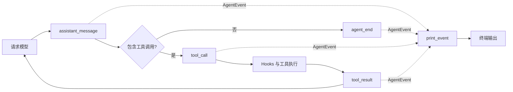
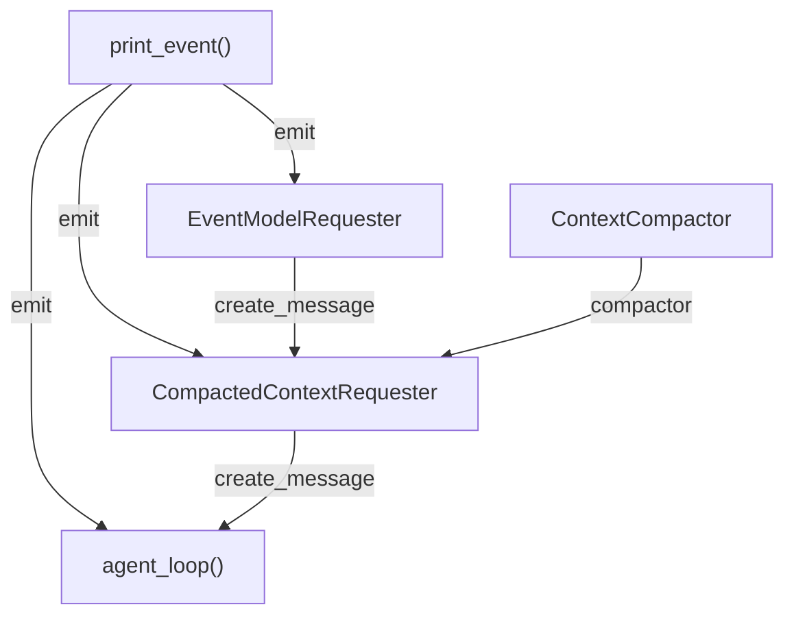

# s08：运行时系统 · 事件边界

s07 已经能在模型请求前压缩上下文，但模型、工具和压缩组件仍直接决定终端输出。s08 引入最小 `AgentEvent + EventSink` 边界：运行组件只报告发生了什么，终端函数决定如何显示。

## 为什么需要事件

s07 的工具流程同时负责执行和展示：

```python
print(format_tool_call(name, arguments))
output = execute_tool(name, arguments, dispatch=dispatch, hooks=hooks)
print(format_tool_result(output))
```

s08 把它改成：

```python
emit(AgentEvent("tool_call", {"name": name, "arguments": arguments}))
output = execute_tool(name, arguments, dispatch=dispatch, hooks=hooks)
emit(AgentEvent("tool_result", {"name": name, "output": output}))
```

`agent_loop()` 不再知道 ANSI 颜色、截断长度或终端文案。同一个事件以后可以交给终端、测试或其他消费者，本章仍只实现同步终端消费者。

## 运行流程



事件按实际时间发生。例如模型先请求工具、工具完成后模型再回答：

```text
assistant_message(tool_use)
    → tool_call
    → tool_result
    → assistant_message(text)
    → agent_end
```

事件中的工具结果保持完整；`print_event()` 调用既有格式化函数时才生成截断预览，因此展示策略不会污染后续模型上下文或会话记录。

## 组装结构

箭头表示左侧向右侧提供依赖，线上标明注入参数；执行先后见上方运行流程。



`main()` 把同一个 `print_event` 作为 `emit` 注入三个组件。模型请求器报告请求状态；压缩请求器报告压缩结果；核心循环报告助手消息、工具调用、工具结果和结束状态。

## Event 和 Hook 的区别

二者都位于运行边界，但职责不同。

### Hook 可以干预

```python
result = before_tool_hook(name, arguments)
if result is not None:
    return result
```

Hook 的返回值会影响执行，可以拒绝工具、修改参数或修改结果。

### Event 只报告事实

```python
emit(AgentEvent("tool_call", {"name": name, "arguments": arguments}))
```

EventSink 的返回值不会进入 Agent 决策。可以简单记成：

```text
Hook：执行前后询问“是否允许、是否修改”
Event：执行过程中通知“发生了什么”
```

例如一次工具调用的真实顺序是：

```text
tool_call Event                 先向外报告准备调用什么
    ↓
BeforeToolHook                  检查权限，可能阻止执行
    ↓
dispatch_tool                   真正执行工具
    ↓
AfterToolHook                   可以加工工具结果
    ↓
tool_result Event               报告最终将写入上下文的结果
```

因此不能用 Event 替代权限 Hook，也不应让 EventSink 修改工具结果。

## 与 lcc、Pi 的对比

lcc 的基础章节保持最直接的教学写法，s01、s02 和上下文压缩章节都在循环中直接 `print()`。lcc s04 把 `PreToolUse`、`PostToolUse` 称为 Hook 事件，但这些回调可以影响执行，不是被动的运行时事件；后面的 team event 则是唤醒 Agent 的业务输入，也不是终端观察事件。

Pi 的 Agent loop 接收 `emit`，把消息、回合和工具执行状态交给外部消费者。这样核心循环不绑定终端，也为流式更新和其他运行时控制提供稳定边界。

s08 保留 lcc 的同步、完整、单章可运行形式，只采用 Pi 的最小事件边界：

```text
lcc：agent_loop → print
Pi：agent_loop → EventStream → consumer
s08：agent_loop → emit(event) → print_event
```

真正的 token 增量流式输出不在本章实现，将在 s09 基于同一 EventSink 增加；s08 只验证运行和展示已经分离。

## 运行

本章复用 [s07 的模型窗口预算](../s07_session_compaction/README.md#运行)，入口显式传入窗口、预留、近期 Token 和摘要额度；没有事件层专用阈值。旧字符参数不再读取，先填写实际 `MODEL_CONTEXT_WINDOW_TOKENS`。

```powershell
# 创建 s08 专属会话并使用终端事件消费者
python -m s08_runtime_events.code

# 加载已有的 s08 会话
python -m s08_runtime_events.code --session .sessions\s08\session-20260922-120000.jsonl
```

终端输出与 s07 基本一致，但来源已经变为：

```text
运行组件 → AgentEvent → print_event() → 格式化输出
```

## 参考与差异

- Pi 的事件流解决核心循环与 UI、日志和控制层耦合的问题；s08 保留 `emit(event)` 边界，但同步 Python CLI 暂不引入异步 `EventStream`。s09 将在该边界上实现 token 增量输出。
- lcc 直接输出的写法适合展示最小循环；s08 保留完整循环和单一新增机制，但把展示移到事件消费者，为后续运行时能力避免反复修改循环。
