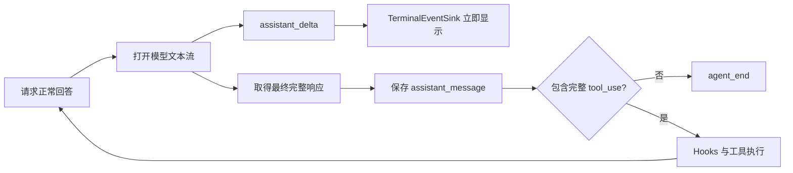
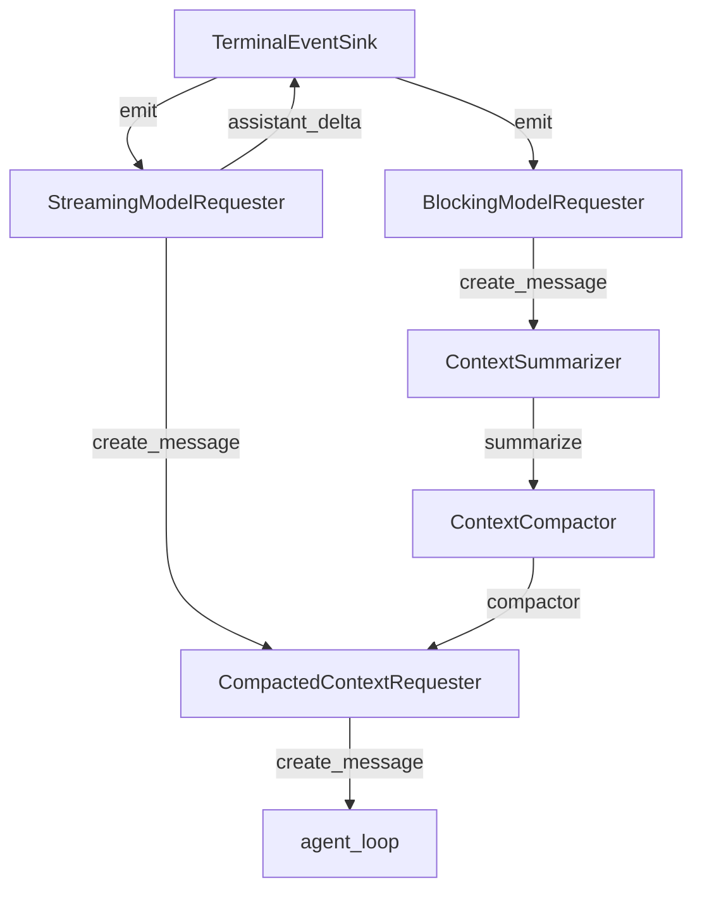

# s09：运行时系统 · 流式响应

s08 把运行状态改为事件；s09 在同一边界上增加 `assistant_delta`，让正常回答逐段显示。增量只用于终端展示，最终完整消息仍负责持久化、上下文和工具调用。

## 运行流程



流式文本和最终消息承担不同职责：

```text
assistant_delta   → 只展示，不写入 JSONL
assistant_message → 完整保存，参与工具调用和后续上下文
```

工具参数在传输过程中可能是不完整的 JSON，因此 s09 不展示也不执行工具调用增量。只有 SDK 返回最终完整消息后，`agent_loop()` 才读取其中的 `tool_use`。

## 组装结构

箭头表示左侧向右侧提供依赖或数据，线上标明参数或数据名称；这里只画 s09 新增组件及其直接关联对象。



这里必须保留两条请求路径：

- `BlockingModelRequester` 只服务内部上下文摘要，等待完整结果，不产生 `assistant_delta`。
- `StreamingModelRequester` 服务正常 Agent 回答，逐段发送文本事件，最后返回 SDK 组装的完整响应。

如果摘要也复用流式请求器，内部压缩文本就会被误当成 Agent 回答显示给用户。

## 事件顺序

普通文本回答：

```text
model_request
→ assistant_delta("这个")
→ assistant_delta("方法负责压缩上下文。")
→ assistant_message(完整消息)
→ agent_end
```

带工具调用的回答：

```text
model_request
→ 可选的 assistant_delta
→ assistant_message(包含完整 tool_use)
→ tool_call
→ tool_result
→ 下一次 model_request
```

`TerminalEventSink` 记住本轮是否已经输出过 delta。收到完整消息时，已经流式显示过就只结束当前行；没有 delta 时则回退为一次性打印完整文本，避免回答重复或消失。

## 运行

```powershell
# 创建 s09 专属会话并流式显示正常回答
python -m s09_runtime_streaming.code

# 加载已有的 s09 会话
python -m s09_runtime_streaming.code --session .sessions\s09\session-20260922-120000.jsonl
```

s09 仍使用 Anthropic Messages API。流式能力要求当前服务端或兼容代理支持该 API 的 streaming 接口。

## 参考与差异

- Pi 在 Agent loop 内消费统一的模型流，并发送 `message_start → message_update → message_end`；它同时处理文本、thinking 和工具调用增量。s09 保留“增量事件只负责观察、最终消息负责状态”的核心边界，但只展示文本 delta，并由 SDK 组装最终工具调用，降低教学复杂度。
- lcc 的渐进章节通常等待完整模型响应后直接输出，重点放在 Todo、Subagent、Skill 等能力。s09 继续采用 lcc 的单章单机制和完整可运行形式，但先完善 Pi 风格的运行时基础。
