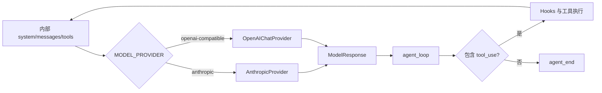
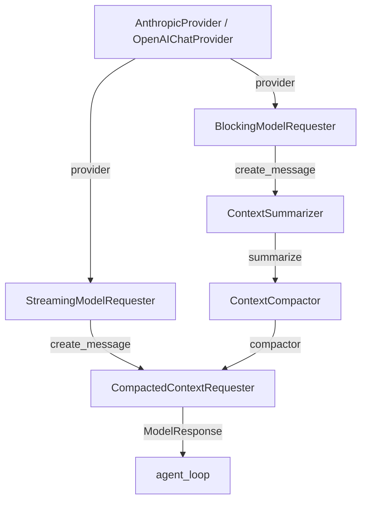

# s10：模型系统 · Provider 边界

s10 将 Anthropic Messages 和 OpenAI-compatible Chat Completions 的协议差异收进 Provider。Agent loop、会话、压缩和工具继续使用同一种内部消息，不需要为 DeepSeek、OpenAI 或 Anthropic 分别实现一套循环。

## 为什么需要 Provider

s09 的 `agent_loop()` 直接读取 Anthropic SDK 响应。只修改 Base URL 可以切换到 Anthropic 兼容服务，却不能接入使用 Chat Completions 消息和 function tools 的服务。

s10 增加两个适配器：

| Provider | 外部接口 | 内部输出 |
|---|---|---|
| `AnthropicProvider` | Messages API | `ModelResponse` |
| `OpenAIChatProvider` | Chat Completions | `ModelResponse` |

OpenAI Chat Completions 使用 `assistant.tool_calls` 和独立 `tool` 消息；流式 usage 通过 `stream_options.include_usage` 返回。s10 将这些字段转换为项目既有的 `tool_use` / `tool_result` 内容块。[OpenAI Chat Completions API Reference](https://developers.openai.com/api/reference/cli/resources/chat)

## 组件关系

| 组件 | 作用 | 输入 | 输出 |
|---|---|---|---|
| `ModelUsage` | 统一 Token 字段 | SDK usage | Provider 无关用量 |
| `ModelResponse` | 统一最终响应 | SDK response | `content/model/stop_reason/usage` |
| `AnthropicProvider` | 适配 Messages API | 内部消息和工具 | `ModelResponse` |
| `OpenAIChatProvider` | 转换 Chat 消息、工具和流增量 | 内部消息和工具 | `ModelResponse` |
| `BlockingModelRequester` | 服务内部摘要 | `ModelProvider` | 完整响应 |
| `StreamingModelRequester` | 服务正常回答 | `ModelProvider` | 文本增量 + 完整响应 |
| `summary_request_options()` | 选择摘要专用参数 | 当前 Provider | 与接口匹配的参数字典 |

内部 `content` 继续使用：

```python
{"type": "text", "text": "回答"}
{"type": "tool_use", "id": "tool-1", "name": "read_file", "input": {...}}
```

因此历史会话保存的是 Harness 内部格式。切换 Provider 后可以加载同一份 s10 会话；发送请求时由当前 Provider 转换为自己的协议。

摘要请求策略来自 s07，接口参数由 s10 选择：`AnthropicProvider` 使用 `thinking: {"type": "disabled"}`；`OpenAIChatProvider` 使用空选项，不猜测所有兼容服务都支持某种关闭思考字段。`main()` 先创建 `summary_options`，再通过 `ContextSummarizer(request_options=summary_options)` 注入；正常回答不携带这些选项。相同模型名不代表相同 API，判断依据是 Provider 类型。

```text
provider → summary_request_options(provider) → summary_options
summary_options --request_options--> summarizer
```

这只是请求策略，不保证兼容服务一定支持关闭思考；服务拒绝参数时保留实际错误，不自动删除参数后重复计费请求。

## 运行流程



## 组装结构

箭头统一表示左侧向右侧提供依赖或数据，线上标明构造参数或返回值；这里只画 s10 新增组件及其直接关联对象。



这里的两条 `provider` 线都表示依赖注入。阻塞请求器用于内部摘要，流式请求器用于用户可见回答；两者共享同一个 Provider，但展示行为不同。

`main()` 按以下层次组装：

```text
1. 基础配置：timeout + retries + MODEL_PROVIDER
2. Provider：AnthropicProvider 或 OpenAIChatProvider
3. 请求组件：summary_requester + assistant_requester
4. 上下文组件：session + summarizer + compactor
5. 运行组件：request_with_context + hooks → agent_loop
```

## 配置与运行

Anthropic：

```dotenv
MODEL_PROVIDER=anthropic
ANTHROPIC_API_KEY=your-key
MODEL_ID=your-model
```

OpenAI 或 DeepSeek 等兼容接口：

```dotenv
MODEL_PROVIDER=openai-compatible
MODEL_API_KEY=your-key
MODEL_BASE_URL=https://api.deepseek.com
MODEL_ID=your-model
```

```powershell
# 使用 .env 中选定的 Provider 新建 s10 会话
python -m s10_model_provider.code

# 使用当前 Provider 加载已有 s10 会话
python -m s10_model_provider.code --session .sessions\s10\session-20260922-120000.jsonl
```

## 参考与差异

- Pi 在独立 AI 包中统一多种 Provider、流式事件、模型元数据和费用。s10 保留“Provider 负责协议差异”的边界，但只实现当前项目实际配置的 Anthropic 与 OpenAI-compatible 两条路径，降低阅读成本。
- lcc 的章节通常固定使用 Anthropic 客户端。s10 保留其单文件可运行结构，但让 Agent loop 依赖项目内部响应，解决 DeepSeek 等 Chat Completions 服务不能仅靠 Base URL 接入的问题。
- s11 将直接读取 `ModelResponse.usage` 实现追踪与统计，以验证统一响应不仅支持切换模型，也能复用上层运行组件。
