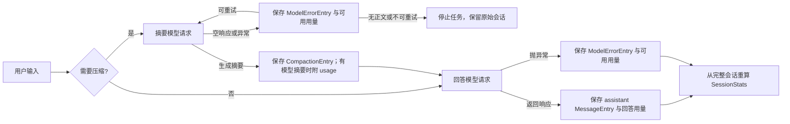
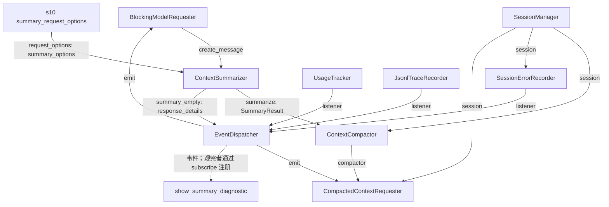

# s11：运行时系统 · 追踪与会话用量

s11 通过 Event 显示运行过程、记录紧凑 Trace 和统计本轮指标；模型用量随对应的会话记录持久化。退出程序后用 `--session` 继续对话，可以从完整会话历史重算累计用量。

## 核心思路

```text
普通回答  → MessageEntry：assistant 内容 + model + stop_reason + usage
摘要压缩  → CompactionEntry：摘要 + 保留尾部 + 生成摘要的 usage
调用异常  → ModelErrorEntry：没有形成消息的失败调用 + 可获得的 usage
```

例如一次回答消耗 120 Token，随后摘要请求消耗 70 Token，再次回答消耗 95 Token，三个用量分别保存在产生它们的记录里。恢复会话后遍历全部记录，累计为 285 Token；压缩过的旧回答仍留在 JSONL，因此不会漏算。

`s10` 的 Provider 在 usage 缺失时会给出全零 `ModelUsage`。s11 在自己的请求边界把全零占位解释成“未知”；正常调用至少有输入或输出 Token，所以不会把真实用量当零。失败异常若暴露 `usage`，s11 会保存它；异常没有提供用量时无法从错误文本推算，统计标为未知。

摘要请求返回空文本也会消耗 Token，它作为未生成摘要的调用立即保存到 `ModelErrorEntry`；若随后重试成功，成功那次的用量随 `CompactionEntry` 保存。旧版 s11 会话仍可读取，但旧记录原本未保存 usage，无法追溯真实 Token。

## 组件关系

| 组件 | 职责 | 主要输出 |
|---|---|---|
| `EventDispatcher` | 把运行事件广播给观察者 | 终端、Trace、本轮统计 |
| `UsageTracker` | 消费事件，统计一次自然语言任务 | `RunStats` |
| `JsonlTraceRecorder` | 保存简短运行轨迹 | Trace JSONL |
| `SessionManager` | 保存回答、压缩和异常调用 | 会话 JSONL、模型上下文 |
| `ContextSummarizer` | 生成摘要，记录未产生摘要的尝试 | `SummaryResult` |
| `ContextCompactor` | 压缩上下文并保存摘要用量 | `CompactionEntry` |
| `SessionStats` | 遍历全部会话记录，重算调用数、工具调用数和用量 | 会话统计文本 |
| `_summary_response_details()` | 统计空摘要的响应结构，不记录原文 | 类型、长度、停止原因、请求选项与用量 |
| `show_summary_diagnostic()` | 消费空摘要事件显示诊断 | 一行终端信息 |

Trace 只保存运行事实和工具结果预览，不复制完整对话。模型上下文仍由会话投影生成，只含对话消息、最新摘要和保留尾部，不含 usage、模型名称等统计字段。

## 运行流程



同一轮还会发送 `model_request`、`model_response` 或 `model_error` 等事件；`UsageTracker` 用它们生成本轮统计。流式文本片段只负责展示，Token 只在模型调用结束后计一次。

## 组装结构

箭头统一表示左侧向右侧提供依赖或数据，线上标明实际参数、注册方式或数据名称；只画本章新增组件及其直接关联对象。



`main()` 先打开会话，再组装观察者、两个模型请求器、摘要器和压缩器，最后把 `request_with_context` 与 `session.append_assistant` 传给 `agent_loop`。终端每轮显示“本轮”和“会话累计”两行，后者每次从会话 JSONL 重算模型请求、Token 和工具调用次数。工具耗时与工具错误次数目前只在本轮事件中统计。

## 摘要请求与失败诊断

空摘要是 s07 压缩机制的问题边界，不是 s12 的技能加载机制。s11 沿用 s07 的摘要专用选项，由 s10 Provider 层按接口选择；不会给正常任务关闭思考。摘要失败时先记录失败用量，再停止任务，不写回退压缩记录。

`ContextSummarizer` 在原有 `summary_empty` 事件中附加 `response_details`；`show_summary_diagnostic` 与 `trace_recorder` 接收同一个事件，统计器只计一次失败。元数据包含 Provider 转换后的内容块类型、正文/思考/提取正文长度、未知块字段名与字符串长度、停止原因、实际额度、用量和 `requested_thinking`。不记录正文、思考原文或签名。

示意输出：

```text
摘要诊断  停止=max_tokens；额度=4096 tokens；请求思考=disabled；内容块=thinking；正文=0 字符；思考=15000 字符；提取正文=0 字符。
```

- 只有 `thinking`、正文为 0、额度用尽：最终摘要尚未出现。
- `requested_thinking=disabled` 仍返回只有思考：关闭参数已发送，但当前兼容服务未按预期返回正文，需要核对服务支持情况。
- 出现未知内容块：检查响应结构及解析规则；不能直接当作摘要。
- 内容块为空：这里只知道转换后的响应为空，仍需检查 Provider 转换及上游返回。

单次自然语言任务最多 12 轮回答请求（不计摘要请求）；耗尽上限时报未完成，保留已经执行的工具结果。请求失败同样发出结束事件。s12 复用这套运行时保护，同时保留自己的完整循环源码供阅读。

查看当前章节最新 Trace 的诊断（运行 s12 时将路径改为 `.traces\s12\*.jsonl`）：

```powershell
$summaryTrace = Get-ChildItem .traces\s11\*.jsonl | Sort-Object LastWriteTime -Descending | Select-Object -First 1
Get-Content -LiteralPath $summaryTrace.FullName -Encoding utf8 | ForEach-Object { ConvertFrom-Json $_ } | Where-Object { $_.type -eq 'summary_empty' } | Select-Object -ExpandProperty data | ConvertTo-Json -Depth 8
```

## 运行

```powershell
# 新建 s11 会话，并在 .traces/s11 下记录运行轨迹
python -m s11_runtime_observability.code

# 恢复指定会话；累计用量从该会话文件重新计算
python -m s11_runtime_observability.code --session .sessions\s11\session-20260922-120000.jsonl
```

## 参考与差异

- Pi 把回答用量放在 assistant 消息、摘要用量放在 compaction entry，并遍历完整会话统计。s11 采用相同的归属方式；本项目摘要重试产生的空响应，以及无消息的调用异常，用 `ModelErrorEntry` 保留用量。
- lcc 用小章节逐步展示 Agent 机制。s11 延续这种可运行的章节结构；Event 负责运行观察，Session 保存可恢复的完整事实，两者各有明确用途。
