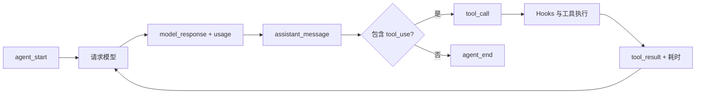
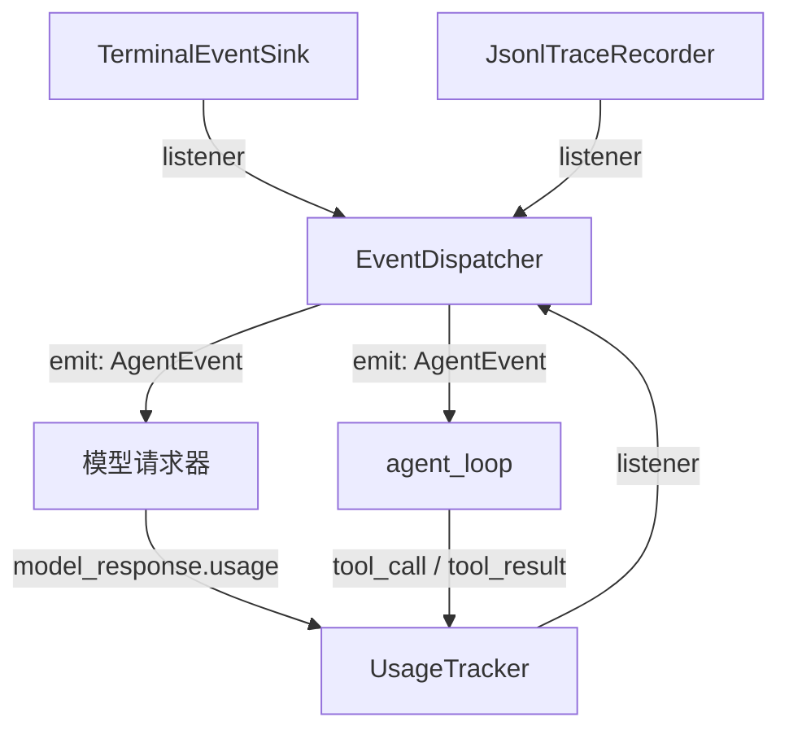

# s11：运行时系统 · 追踪与用量

s11 直接复用 s10 的 Provider 和事件边界：Agent 仍按原流程工作，同一份事件额外交给 Trace 和统计消费者。Anthropic、OpenAI 或 DeepSeek 的原始 usage 已由 s10 转成统一 `ModelUsage`，本章不再解析任何 SDK 字段。

## 核心设计

Hook 和 Event 的职责不同：

```text
Hook  → 在行为发生前后进行阻断或修改
Event → 报告已经发生的事实，供显示、记录和统计
```

因此 `UsageTracker` 不注册为工具 Hook。它只消费 `model_response`、`tool_call` 和 `tool_result` 等事件，不会改变消息或工具结果。

## 组件关系

| 组件 | 作用 | 主要输入 | 主要输出 |
|---|---|---|---|
| `EventDispatcher` | 将一个事件按顺序广播给多个消费者 | `AgentEvent` | 调用所有 `EventSink` |
| `TerminalEventSink` | 显示流式回答和工具状态 | 运行事件 | 终端文本 |
| `JsonlTraceRecorder` | 保存紧凑运行记录 | 运行事件 | Trace JSONL |
| `UsageTracker` | 累计模型、工具、Token 和耗时 | 运行事件 | `RunStats` |
| s10 `ModelUsage` | 提供统一 Token 字段 | Provider 响应 | 可序列化用量 |

完整对话仍保存在 Session JSONL。Trace 不重复保存完整上下文：它跳过 `assistant_delta`，只保存助手消息类型、工具结果长度和最多 500 字符预览等运行信息。

## 运行流程



一次模型请求只在最终响应到达后记录一次 usage。流式 `assistant_delta` 只负责即时展示，不按片段猜测或重复累计 Token。

## 组装结构

箭头统一表示左侧向右侧提供依赖或数据，线上标明实际参数或事件名称；这里只画 s11 新增组件及其直接关联对象。



图中的三条 `listener` 线含义相同：三个组件作为并列消费者注册进 `EventDispatcher`。它们不是逐层包裹，也不会互相调用。

`main()` 按以下层次显式组装：

```text
1. 观察层：terminal + trace_recorder + usage_tracker → events
2. 模型层：summary_requester / assistant_requester → events.emit
3. 上下文层：session + policy + summarizer → compactor
4. 请求层：assistant_requester + compactor → request_with_context
5. 循环层：request_with_context + hooks + events.emit → agent_loop
```

## Trace 示例

```json
{"type":"model_response","data":{"purpose":"assistant","usage":{"input_tokens":120,"output_tokens":32,"total_tokens":152}}}
{"type":"tool_call","data":{"tool_call_id":"tool-1","name":"read_file","arguments":{"path":"README.md"}}}
{"type":"tool_result","data":{"tool_call_id":"tool-1","name":"read_file","is_error":false,"output_chars":860}}
```

## 运行

```powershell
# 新建 s11 会话，同时在 .traces/s11 下创建运行 Trace
python -m s11_runtime_observability.code

# 加载已有的 s11 会话；本次进程仍创建独立 Trace
python -m s11_runtime_observability.code --session .sessions\s11\session-20260922-120000.jsonl
```

## 参考与差异

- Pi 的低层 Agent 发送 message、turn 和 tool execution 事件，Session 再通过订阅完成持久化和统计。s11 保留“运行事实先事件化、观察者再消费”的设计，但暂时只实现当前运行所需事件，避免提前加入并行工具和多 Agent 生命周期。
- Pi 将 usage 保存在 assistant message 和 Session Entry 中，可统计完整会话成本。s11 复用 s10 的统一 usage，但为了不修改 s06 的教学会话格式，先把它写入独立 Trace。
- lcc 更强调每章直接展示新增 Agent 能力。s11 延续其单章单机制和可运行示例，但把可观测性作为 Harness 运行时能力，而不是写入系统提示词或工具实现。
