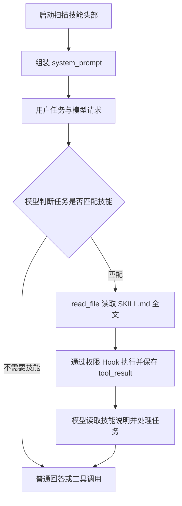
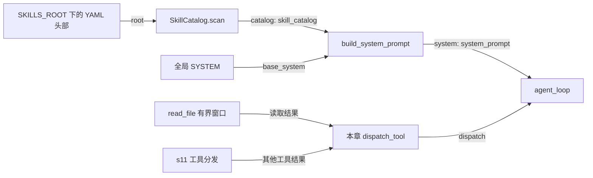

# s12：能力系统 · Skills 按需加载

s12 在 s11 基础上加入技能目录。启动时只把名称、描述和 `SKILL.md` 路径提供给模型，任务匹配时由模型调用已有 `read_file` 读取完整说明，再按说明完成任务。

## 为什么分两次加载

系统提示词每次请求都会发送。若把所有技能全文塞进去，一次简单提问也要携带代码审查、测试等无关说明。s12 只固定提供小目录，完整技能作为工具结果按需进入会话。

```text
启动：SYSTEM + 技能目录 → 回答模型
任务匹配：read_file(SKILL.md) → tool_result → 下一次回答模型请求
```

这里没有额外的 `load_skill` 工具。模型从目录获得准确路径，使用原有读文件工具即可。技能本身是工作说明；是否执行某项操作，仍取决于用户任务及工具权限。

## 新增组件与方法

| 组件 / 方法 | 输入 | 输出及职责 |
|---|---|---|
| `Skill` | 名称、描述、路径 | 只保存目录信息，不缓存正文 |
| `_read_skill_metadata()` | `SKILL.md` 路径 | 只解析开头的 YAML；底层文件读取 |
| `SkillCatalog.scan()` | 技能根目录 | 发现并校验技能，返回 `SkillCatalog` |
| `build_system_prompt()` | 基础 `SYSTEM`、目录 | 生成含目录的 `system_prompt` |
| `read_file()` | 路径、起始行、行数 | 返回有界代码窗口及继续位置 |
| `dispatch_tool()` | 已通过 Hooks 的工具调用 | 读取用本章窗口；其他工具复用 s11，超长结果存档 |

`main()` 是组装入口：先获得 `skill_catalog`，再生成 `system_prompt`，最后通过 `agent_loop(system=system_prompt)` 传给回答请求器。摘要请求仍使用 s07 的专用摘要提示词。

## 运行流程



选择技能是模型根据描述做出的决定，不是 Python 根据关键词强制匹配。加载规则来自提示词，不保证每种模型都一定遵守；需要观察工具日志确认是否实际读取。

## 组装结构

箭头统一表示左侧向右侧提供依赖或数据，线上标明真实参数或数据名称。这里只画技能新增组件及直接关联对象。



`SkillCatalog` 没有装进压缩器或请求器；它只用于组装系统提示词。Hooks、会话、摘要器、诊断和轮数保护均复用 s11；本章仍显式展开完整 `agent_loop` 便于阅读，不另写摘要实现。运行时的结构图与诊断说明见 s11。

## 技能文件

```text
s12_skill_loading/
├─ code.py
└─ skills/
   └─ code-review/
      └─ SKILL.md
```

`SKILL.md` 的 YAML 头部示例：

```yaml
---
name: code-review
description: 审查指定代码或 Git 变更，定位有证据的正确性问题。
---
```

头部之后写中文工作说明。名称须与文件夹一致，使用小写字母、数字和连字符；描述必须非空。启动只扫描 `skills/*/SKILL.md`，格式错误会报告文件路径；目录不存在时不添加技能提示。新增或修改目录信息后重启程序，正文则在读文件时取得。

## 运行与观察

在仓库根目录执行，使用已配置的 Python 环境和 `.env`：

```powershell
# 新建 s12 对话；会话与 Trace 分别写入 .sessions/s12 和 .traces/s12
python -m s12_skill_loading.code

# 用终端显示的会话路径继续对话
python -m s12_skill_loading.code --session .sessions\s12\session-具体时间.jsonl

# 离线验证技能扫描及 read_file → 会话 → 用量链路
python -m pytest tests/test_s12_skill_loading.py
```

可以输入：

```text
按 code-review 技能，只读审查 s12_skill_loading/code.py 中的 SkillCatalog.scan，指出有证据的问题。
```

应看到先调用 `read_file` 读取技能文件，再分段定位并读取指定方法。技能读取属于只读工具，无需单独批准；长技能须按继续提示读完。若模型选择 shell 命令，仍可能触发原有权限检查。结果保存到会话，Trace 只记预览。

## 防止反复读取与搜索

这是 B007 在 s12 的再次出现，具体日志证据和回归测试见 [B008](../docs/bug-log.md#b008s12-读取技能与代码后反复搜索)。修复分三个边界，不把行为约束全部塞进系统提示词：

- **技能说明**：限定审查范围，按行窗口读取，只为具体疑点补读关联代码；信息不足时明确说明，不无限搜索。
- **工具返回**：`read_file` 每次最多 80 行、4000 字符正文，两个预算先到者生效。未读完时附上准确的下一行。超大单行报告限制，不跳过它。其他工具超过 4000 字符时，全文保存到 `.sessions/s12/tool-results/*.txt`，JSONL 和模型只收到预览及路径。说明文字不计入正文预算。
- **失败停止（复用）**：s11 的运行时最多允许 12 轮回答请求（不计摘要请求）；s07 的摘要机制拒绝空摘要覆盖上下文。s12 使用同一策略，超限或摘要失败时停止，保留原始记录。

```text
技能约束读取范围 → 工具返回有界证据 → 模型审查并回答
                           ↓
              空摘要 / 轮数耗尽 → 明确报错并停止
```

这不是 shell 沙箱，也不能保证模型永远不选 bash：shell 仍会先生成完整输出；每轮还可能包含多个工具调用。工具窗口在本章返回边界限制内容；摘要失败与轮数保护属于前面章节，不属于 Skills 的新增机制。

复测建议直接新建对话，不加载已经反复压缩的旧会话。离线测试验证预算、继续位置、输出存档、空摘要停止和轮数上限；没有代替真实模型的任务完成率验证。

## 空摘要怎么定位

摘要策略属于 s07，接口参数属于 s10，诊断属于 s11；s12 只复用。默认 Anthropic 摘要请求显式关闭思考，正常任务保持原样；空摘要的结构诊断与解释见 [s11：摘要请求与失败诊断](../s11_runtime_observability/README.md#摘要请求与失败诊断)，复现证据见 [B009](../docs/bug-log.md#b009摘要额度提高后仍无正文缺少响应结构证据)。

新建对话再运行原审查任务。如果仍失败，把“摘要诊断”一行及终端显示的 Trace 路径保留下来：特别检查 `请求思考=disabled` 是否仍收到只有 `thinking` 的响应，这表示需要核对兼容服务支持情况，不应继续盲目增加预算。

## 参考与差异

- lcc 的 Skill Loading 通过目录减少固定上下文，再用 `load_skill` 返回正文。s12 保留渐进加载流程，复用 `read_file`，减少专用工具和分发分支；本章离线测试验证正文确实进入后续模型请求。
- Pi 提供名称、描述、路径，并用已有读取能力加载技能。s12 保留这个边界，只扫描本章项目内的单层目录；不引入多来源资源合并。扫描阶段只读取 YAML，技能正文不缓存。
- Pi 的读文件和 shell 工具在返回阶段限制输出，并提供继续读取或完整输出路径，避免超大结果占用模型上下文。s12 保留这个设计，采用适合当前 24,000 字符压缩阈值的更小预算；本章测试验证窗口可继续、完整 shell 输出可找回。运行时安全兜底来自 s07/s11，不宣称与 Pi 的失败策略相同。
- s13 按规划增加 Python Extension 的工具、Hooks 和事件注册，验证“技能说明”与“执行代码”可以分别接入当前 Harness；这些接口不提前写进 s12。
